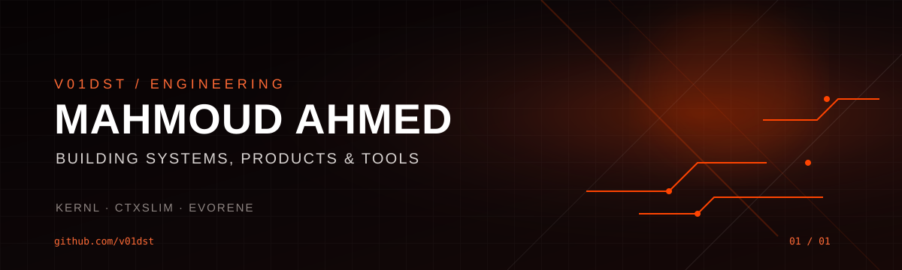

<p align="center">
  
</p>

<p align="center">
  <a href="https://discord.com/users/9p.1">Discord</a> ·
  <a href="https://www.linkedin.com/in/mahmoud-ahmed-8a349842b/">LinkedIn</a> ·
  <a href="https://github.com/v01dst">GitHub</a>
</p>

<h3 align="center">I build things that turn ideas into reality.</h3>

<p align="center">Full-stack developer · AI tinkerer · Product builder · Designer</p>

<br/>

> I’m interested in the space where **software, AI, design, and ambitious ideas** meet.
>
> I like understanding how things work under the hood, building my own tools, and turning rough ideas into something people can actually use.

### 01 / how I think

**Build from first principles.**  
**Keep the stack replaceable.**  
**Make complicated things feel simple.**  
**Ship → learn → rebuild better.**

### 02 / things I’m into

```text
AI & agents          ████████████████████
Systems & tooling    ██████████████████░░
Product & design     █████████████████░░░
Open source          ████████████████░░░░
3D & creative tech   █████████████░░░░░░░
Cybersecurity        ████████████░░░░░░░░
```

### 03 / my toolbox

<p align="center">
  
</p>

### 04 / currently

- Building software instead of collecting ideas.
- Exploring AI agents, MCP, local-first tooling, and model infrastructure.
- Learning deeper systems engineering and cybersecurity.
- Designing products with the same attention I give the code.
- Trying to make every project a little more ambitious than the last.

### 05 / outside the terminal

**Music** · Drake · Billie Eilish · Laufey  
**Movies** · Marvel  
**Games** · BeamNG · story-driven games  
**Chess** · playing, studying, trying to get better  
**Weather** · cold > Egyptian summer

### 06 / find me

<p align="center">
  <a href="https://discord.com/users/9p.1">
    
  </a>
  <a href="https://github.com/v01dst">
    
  </a>
</p>

<p align="center"><sub>still building. still learning. still curious.</sub></p>