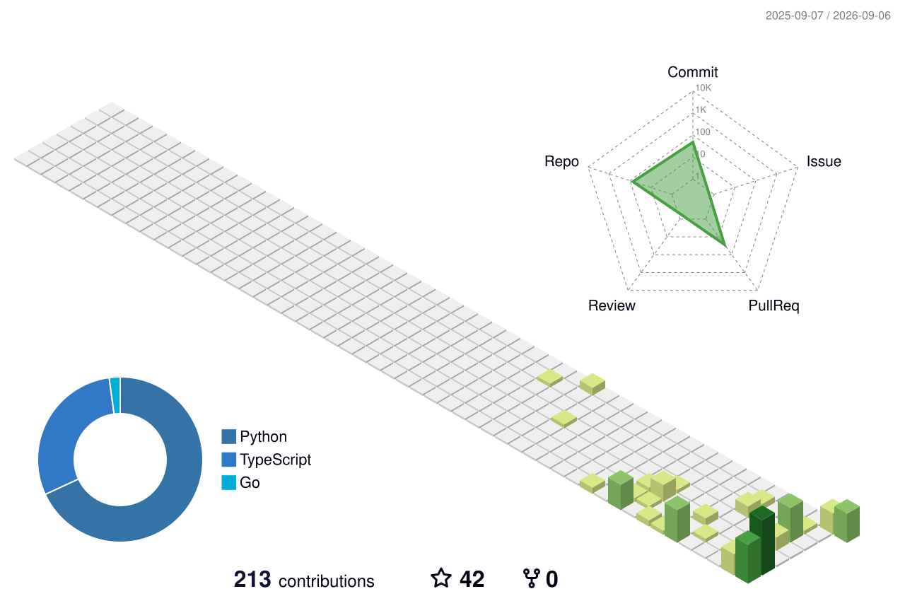

<h1 align="center">
  
</h1>

  &nbsp;&nbsp;&nbsp;&nbsp;
  &nbsp;&nbsp;&nbsp;&nbsp;
  

  🔭 I'm currently building <b>Kernl</b> — an AI-powered platform that turns startup ideas into real products 
  🤖 Also building <b>AgentForge</b> — a model-agnostic AI agent framework, CLI & workflow engine 
  🌱 Exploring AI systems, cybersecurity & product development 
  💬 Ask me about anything — <a href="https://github.com/v01dst/v01dst/issues" title="Issues">open an issue</a> or ping me on Discord 
  ⚡ I learn by building. If I don't know how something works, I build something that forces me to find out

<h2 align="center"> ⚙️ Tools of Trade ⚙️ </h2>
 

  &nbsp;&nbsp;&nbsp;
  &nbsp;&nbsp;&nbsp;
  &nbsp;&nbsp;&nbsp;
  &nbsp;&nbsp;&nbsp;
  &nbsp;&nbsp;&nbsp;
  

  &nbsp;&nbsp;&nbsp;
  &nbsp;&nbsp;&nbsp;
  &nbsp;&nbsp;&nbsp;
  &nbsp;&nbsp;&nbsp;
  &nbsp;&nbsp;&nbsp;
  

  &nbsp;&nbsp;&nbsp;
  &nbsp;&nbsp;&nbsp;
  &nbsp;&nbsp;&nbsp;
  

<h2 align="center"> ⚡ Stats ⚡ </h2>
 

  

    
    
  

            
  

    
  

   
  

<h2 align="center"> 👨‍💻 Repositories 👨‍💻 </h2>
 

  
  

      

  
  

      

  
  

      

<h4 align="center">
  <a href="https://github.com/v01dst?tab=repositories" title="Show Repositories">🔎 Show More 🔍</a>
</h4>

<h2 align="center"> 🛰️ Live Status 🛰️ </h2>

<i>refreshed every 6 hours by a GitHub Action</i>

<!-- STATUS:START -->

**⚡ 29 public repos · ⭐ 41 total stars · 👥 1 followers · 🚀 latest push `2026-09-04`**

| Repo | What it is | Lang | ★ | Last push |
| --- | :--- | :--- | :---: | :---: |
| [v01dst](https://github.com/v01dst/v01dst) | No description | Python | 2 | 2026-09-04 |
| [pwgen-cli](https://github.com/v01dst/pwgen-cli) | No description | Go | 1 | 2026-09-04 |
| [markdawn](https://github.com/v01dst/markdawn) | No description | TypeScript | 1 | 2026-09-04 |
| [request-inspector](https://github.com/v01dst/request-inspector) | No description | Go | 0 | 2026-09-04 |
| [heartbeat-hub](https://github.com/v01dst/heartbeat-hub) | No description | Python | 1 | 2026-09-04 |
| [pastebin](https://github.com/v01dst/pastebin) | No description | TypeScript | 1 | 2026-09-04 |

<!-- STATUS:END -->

<h2 align="center"> 📊 Language Breakdown 📊 </h2>

<!-- LANGUAGES:START -->

### [v01dst](https://github.com/v01dst/v01dst)
No description

**Python**  ██████████████████████ `100.0%`

---

### [pwgen-cli](https://github.com/v01dst/pwgen-cli)
No description

**Go**  █████████████████████░ `97.7%`
**Dockerfile**  █░░░░░░░░░░░░░░░░░░░░░ `2.3%`

---

### [markdawn](https://github.com/v01dst/markdawn)
No description

**TypeScript**  █████████████████████░ `96.2%`
**Dockerfile**  █░░░░░░░░░░░░░░░░░░░░░ `3.8%`

---

### [request-inspector](https://github.com/v01dst/request-inspector)
No description

**Go**  █████████████████████░ `96.2%`
**Dockerfile**  █░░░░░░░░░░░░░░░░░░░░░ `3.8%`

---

### [heartbeat-hub](https://github.com/v01dst/heartbeat-hub)
No description

**Python**  █████████████████████░ `97.4%`
**Dockerfile**  █░░░░░░░░░░░░░░░░░░░░░ `2.6%`

---

### [pastebin](https://github.com/v01dst/pastebin)
No description

**TypeScript**  ██████████████████████ `97.8%`
**Dockerfile**  ░░░░░░░░░░░░░░░░░░░░░░ `2.2%`

<!-- LANGUAGES:END -->

<h2 align="center"> 🧊 3D Contribution Graph 🧊 </h2>

<h4 align="center">
  <i>"build something worth keeping."</i>
</h4>
