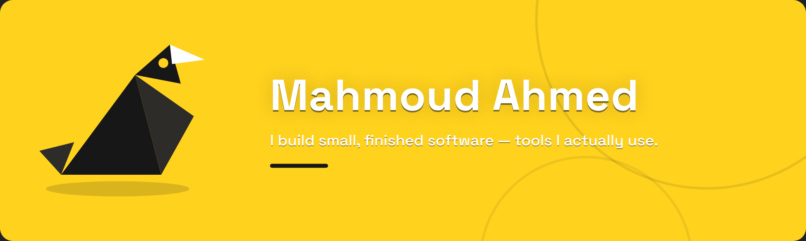

  

  <a href="https://github.com/v01dst?tab=repositories">Repositories</a>
  ·
  <a href="https://github.com/evorene">Evorene</a>
  ·
  <a href="https://discord.com/users/9p.1">Discord</a>

---

  <a href="https://github.com/v01dst/ctxslim"><b>CtxSlim</b> — shipped v0.2.0</a> 
  Put your MCP servers on a diet. 33.4k → 9.2k tokens (-72.6%). 100% local, zero API keys. 
  <code>npx -y ctxslim</code> 
  <a href="https://github.com/v01dst/ctxslim">Repo</a> · <a href="https://github.com/v01dst/ctxslim/releases/tag/v0.2.0">Release</a> · <a href="https://www.npmjs.com/package/ctxslim">npm</a>

---

Discord: <code>9p.1</code> — fastest way to reach me.

---

<i>build something worth keeping.</i>

